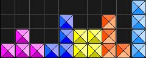
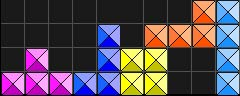
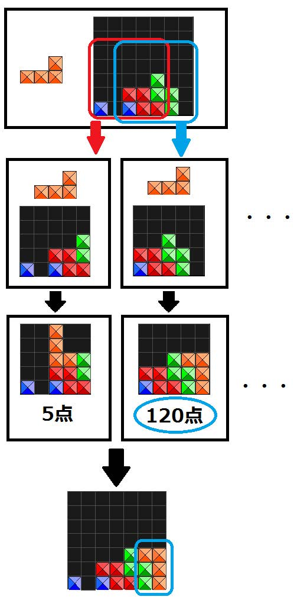
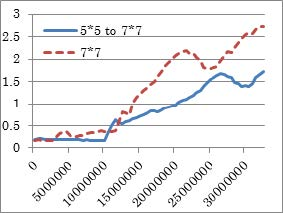
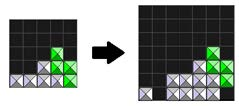

# ゲームAI勉強会

<h3>
	
	<a href="https://twitter.com/kiito1000">Tokiwa</a> (B4)
</h3>

#### 2018/04/27

---

## [テトリスを題材にしたスケールダウンを利用した学習手法の開発](https://ipsj.ixsq.nii.ac.jp/ej/index.php?active_action=repository_view_main_item_detail&page_id=13&block_id=8&item_id=183842&item_no=1)

---

### 概要
##### <u>テトリスの新しい汎用的学習方法を開発した</u>

---

### 背景

- 評価関数を自動で学習させる 汎用的な手法が流行っている
	- 特に強化学習の一種である **Deep Q-Network** (`DQN`)が成功している
- このような汎用的学習手法は複雑なゲームではうまくいかない
	- テトリスもその一つ
- DQNは**とりあえず適当に**やってみる(ランダム試行)
	- ランダムでやっても良い感じにならないゲームには向いていない

|||

-  簡単な状態で学習した結果を 難しい状態に応用する `転移学習` という手法は難しいゲームにおいて効果がある
	- テトリスにも使えるのでは？
-  簡単な状態をどうやって作るか？
	- 盤を狭める！ (**スケールダウン**)

|||

- うまくいけばスケールダウンできる他のゲームにも応用できる
 - これが自動で評価関数を生み出す汎用的手法の1つになる？

---

### テトリスのルール
- 降ってくるブロックが画面内に置けるように掃除していく落ちゲー
- 横一列がブロックで埋まったらその列のブロックが消える

---

### 関連研究
- DQNは適当にやってもまあまあできる簡単なゲームで効果を上げた
	- 複雑なゲームでは成功せず
- テトリスのAI研究
	- `交差エントロピー法`という手法が効果が高かった
		- ただし評価関数は人間が選定していたので汎用的でない
	- `近似動的計画法`という手法はさらに効果があった
		- ただしこれも人間が選んでいた

---

### テトリスの難しさ

|||

#### オレンジのブロックが降ってきた場合

| 隙間を埋めた状態 | 隙間を埋めなかった状態 |
|:---:|:---:|
|  |  |

- **1回のミスが後に大きく影響する**
	- 適当プレイが弱い原因

---

### テトリスをスケールダウンさせる
- 通常: 20x10ブロック
	- 5x5でも問題なくプレイできる

|||

- 盤面サイズを小さくすれば横一列を揃えやすくなる
	- 盤面サイズの小さい時の学習結果を大きいサイズに利用していく
	- 盤面を分割しその中で最も評価の高い行動を選択する

|||

---

### 実験

#### 実験内容
1. 盤面サイズ 5x5
1. 盤面サイズ 7x7
1. 1の結果を利用した盤面サイズ7x7

|||

#### 手法と定義
- `DQN`を用いる
- 報酬
	- 横列を揃える: `列の数 x 1` 点
	- ゲームオーバー: `-10`点
- 入力
	- 盤面
	- 操作中のピース
	- 次に操作するピース
- 出力
	- ピースのx座標と回転の向きの組み合わせ
		- その中で価値(`Q値`)が最大の手をとる

|||

- 手の選び方
	- 5x5,7x7
		- ε-greedy法 (ε = `0.05`)
		- 確率 `ϵ` で探索、確率 `1-ϵ` でQ値が最大のものを選ぶ
	- 5x5の結果を利用した7x7
		- Q値が最大の手を選択: `90%`
		- ランダム選択: `0.05`
		- 学習結果を利用: `0.05`

|||

#### 結果
##### (1) 5x5
- 4000万回の学習
- 4.66lines / game
	- (参考) 全ランダム:  0.098lines / game
	- ランダムエージェントよりは**大分まし**

|||

##### (2) 7x7

###### 横軸: 学習ステップ数 縦軸: 消去ライン数 / game

- 普通に7x7を学習した方が性能が良いという残念な結果に

---

### 考察

#### 性能低下の原因
- **狭い盤面で評価の高い手が必ずしも元の広い盤面でも好手とはいえない**
	- 逆に、狭い盤で評価が悪ければ元の盤面でも評価が悪いとはいえる
		- これを利用して逆に悪手を選ばないようにすればよい？

##### 例

---

### 個人的な感想
- 囲碁とテトリスは似ている？
	- 格子状の盤、盤を拡大・縮小できる
	- テトリスは画像処理をしているイメージ
		- 陣取り: 囲碁
		- 穴埋め: テトリス
	- ただテトリスはもちろん不完全情報 (しかも無限)
- テトリスにおいて列を消すことが必ず正しいのか？
	- 消さなければ次のブロックがはまりやすくなる状況もあるのでは
- 手の選び方の係数がどの程度結果に影響を与えるのか
- 汎用性と性能の両立は難しいそう
- 小さい盤面を抜き出す箇所を、置く座標を中心に決定すればよいのでは？ (素人考え)

---

### 学習に役立った記事
- [ゼロからDeepまで学ぶ強化学習](https://qiita.com/icoxfog417/items/242439ecd1a477ece312)
- [転移学習: 機械学習の次のフロンティアへの招待](https://qiita.com/icoxfog417/items/48cbf087dd22f1f8c6f4)
- [やさしい深層学習の原理](http://gagbot.net/machine-learning/ml4)
- [囲碁AI"AlphaGo"はなぜ強いのか？](http://home.q00.itscom.net/otsuki/20160415AlphaGopublic.pdf)
	- 探索、評価、深層学習、強化学習など基礎的な知識が分かりやすい